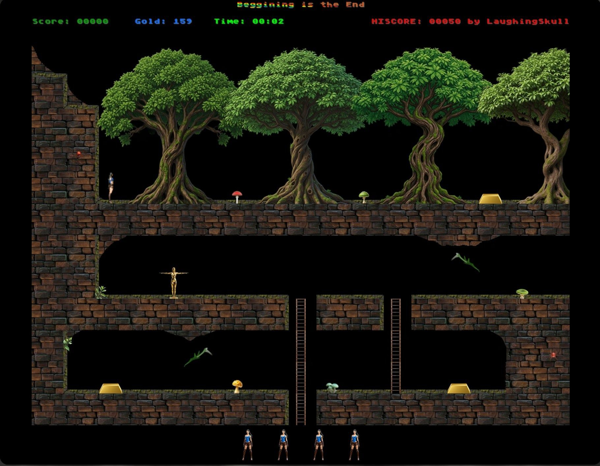
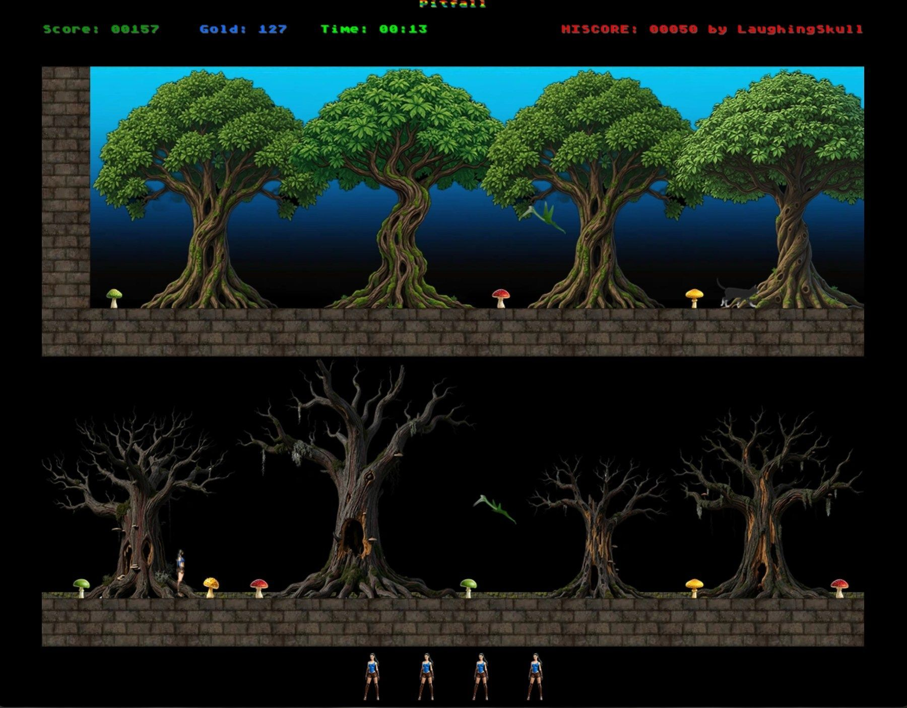
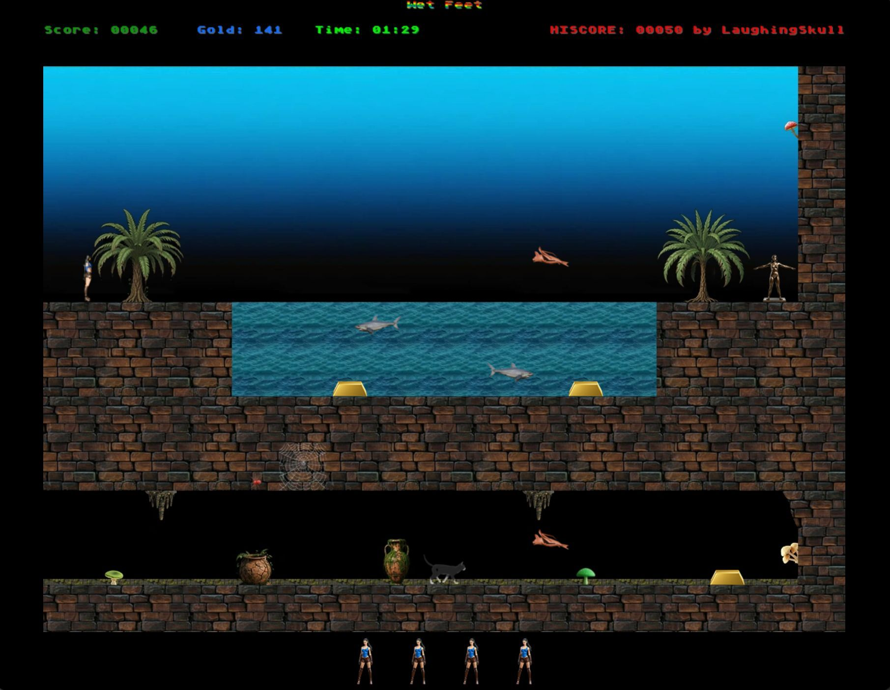
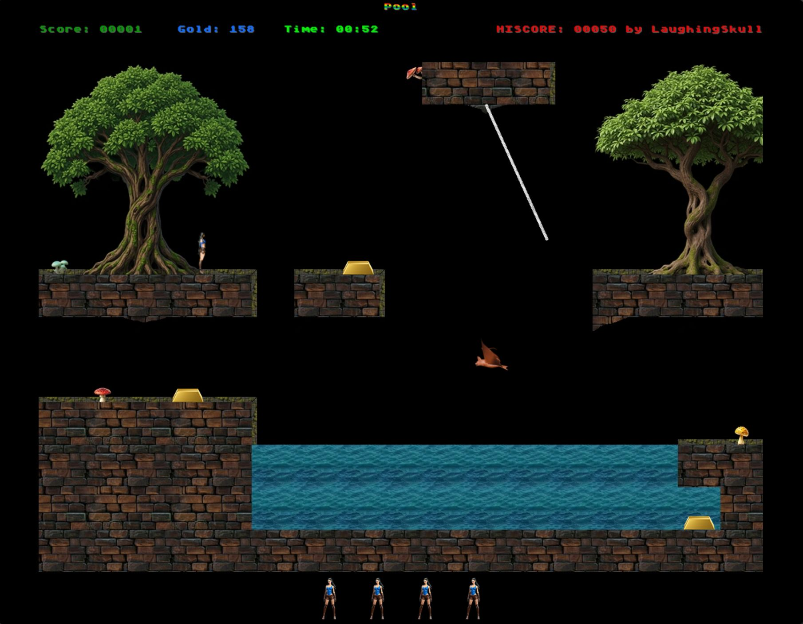
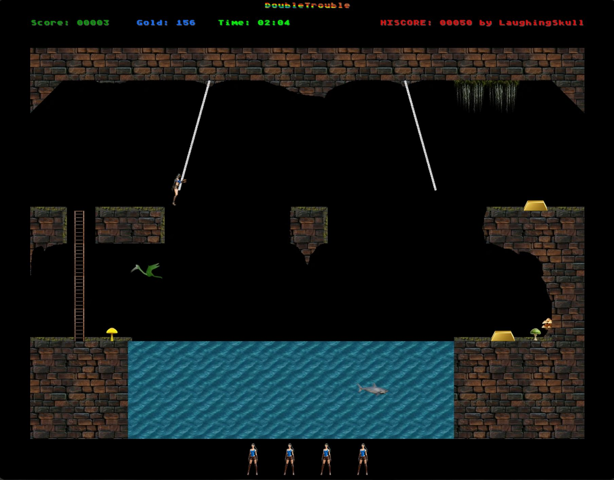
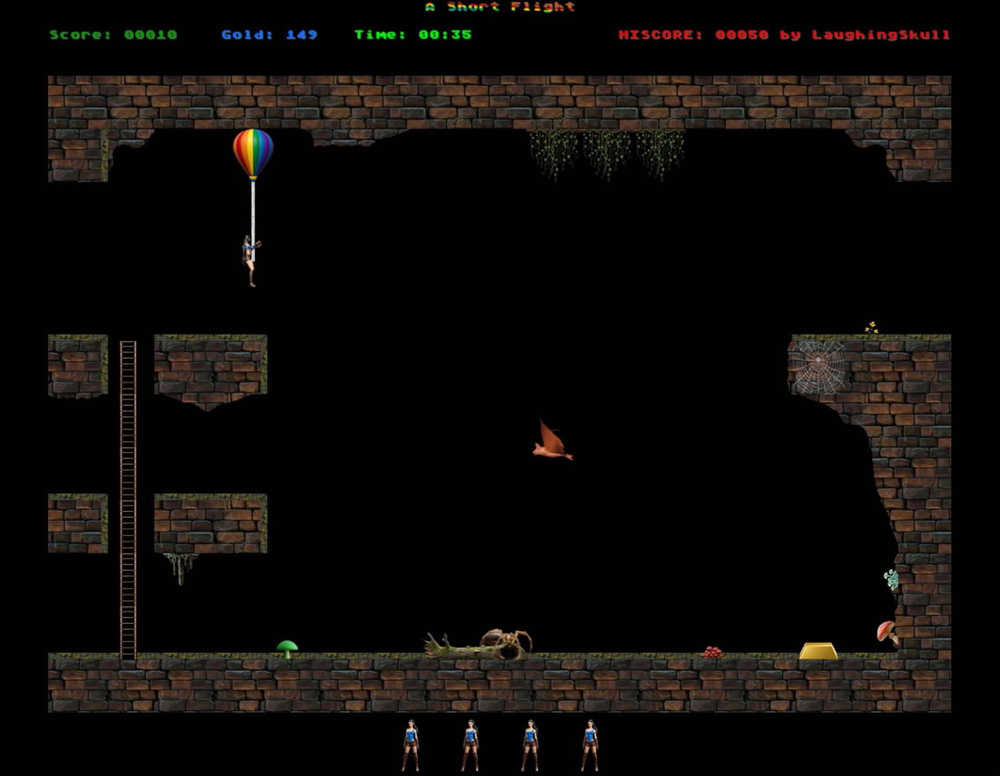

# The Pitiful Chasm Clamber

**A retro platform adventure into a chasm where every shortcut is probably a trap.**

Guide the Princess through a sprawling maze of interconnected caverns. Run, jump, climb, swim, swing across gaps, avoid hostile creatures, and collect treasure while searching for a way through the depths.

Loosely inspired by the legendary *Pitfall!* and especially *Pitfall II*, with touches of *Hunchback* and *Lode Runner*, the game reshapes classic 1980s platforming into a modern “snakes and ladders” arcade adventure.

## Features

- Fixed-screen, maze-like exploration
- Charged jumps, ladders, ropes, and swimming
- Traps, enemies, hidden routes, and treasure
- Built in JavaScript and GLSL using a custom game engine

## Screenshots

| | |
|:---:|:---:|
|  |  |
|  |  |
|  |  |

## License

This project is available under the
[PolyForm Noncommercial License 1.0.0](LICENSE).

You may use, modify, and redistribute it for noncommercial purposes.

© 2026 LaughingSkull
